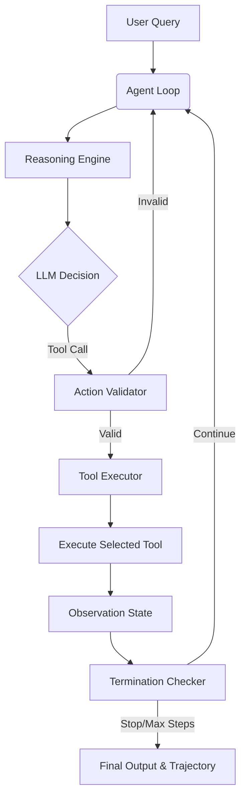

# ReAct V1 Agent: Reasoning and Action Framework

A lightweight, clean, and modular implementation of the **ReAct (Reasoning + Action)** agent pattern in Python. This project demonstrates how an LLM can interact with external tools in a structured execution loop to solve multi-step problems, validate intermediate actions, check for termination, and record full trajectory audits.

---

## 🏗️ Architecture & Component Design

The agent is designed around modular, decoupled components to ensure scalability and testability:



### 📂 Directory Structure

*   `agent/`: Core reasoning and execution loop logic.
    *   `agent_loop.py`: Coordinates states, validation, execution, and termination.
    *   `reasoning_engine.py`: Constructs LLM prompts and parses structured ReAct actions.
    *   `llm_client.py`: API wrapper communicating with the local Ollama LLM provider.
    *   `action_validator.py`: Syntactic check to verify tool parameters before executing.
    *   `termination_checker.py`: Tracks iteration bounds and early termination conditions.
*   `tools/`: Library of tools available to the agent.
    *   `base_tool.py`: Base abstract class for defining new tools.
    *   `tool_registry.py`: Central registration database for looking up tools.
    *   `tool_executor.py`: Dynamic caller for staging and running tool parameters.
    *   `calculator_tool.py`: Built-in arithmetic solver (add, subtract, power, sqrt, etc.).
    *   `search_tool.py`: Simulated web search tool for external knowledge.
    *   `finish_tool.py`: Special termination action invoked by the agent when the goal is met.
*   `schemas/`: Data classes enforcing runtime type validation.
    *   `context_schema.py`: Session log recording trajectory history.
    *   `action_schema.py`: Structured representation of a proposed agent step.
    *   `observation_schema.py`: Structured representation of a tool execution outcome.
*   `tests/`: Unit and integration test suite.
*   `evaluation/`: Performance benchmarking suite.
    *   `benchmarks/`: Category-specific JSON datasets (arithmetic, multi-step, search).
    *   `run_evaluation.py`: Main evaluation harness reporting success, error rates, and step matching.

---

## 🚀 Getting Started

### 📋 Prerequisites
- Python 3.10+
- [Ollama](https://ollama.com/) (recommended for local model hosting)

### 🛠️ Installation & Setup

1. **Clone the Repository** and navigate to the directory:
   ```bash
   cd AGENTS/V1_react/react_V1_agent
   ```

2. **Initialize Python Environment**:
   ```bash
   python -m venv .venv
   source .venv/bin/activate  # On Windows: .venv\Scripts\activate
   ```

3. **Install Dependencies** (if any third-party packages are needed, otherwise standard libraries are utilized):
   ```bash
   pip install -r requirements.txt  # Optional: standard library fallback included
   ```

4. **Start local LLM (Ollama)**:
   ```bash
   ollama pull qwen2.5-coder:7b
   ollama serve
   ```

---

## 💻 Running the Agent

### Interactive CLI Loop
Run the main entrypoint to chat directly with the agent:
```bash
python main.py
```
**Example Interaction**:
```text
Registered tools: ['calculator', 'search', 'finish']
LLM connected: LLMClient(model=qwen2.5-coder:7b)

==================================================
  ReAct V1 Agent Ready
==================================================

You: Find the square root of 144 and multiply it by 5.
...
```

### Verification Script
Run the test script to execute a predefined query programmatically and output the trace:
```bash
python test_run.py
```

---

## 🧪 Testing

To run the unit test suite and ensure parser/reasoning logic matches specifications:
```bash
python -m unittest discover -s tests
```

---

## 📊 Evaluation & Benchmarking

The agent comes with a comprehensive evaluation suite designed to run tasks across multiple categories (`arithmetic`, `search`, `multistep`, `ambiguous`, and `failure_cases`):

Run the default evaluation suite:
```bash
python evaluation/run_evaluation.py
```

Run evaluation on a specific task category:
```bash
python evaluation/run_evaluation.py --category arithmetic
```

Metrics captured include:
*   **Tool Sequence Match Rate**: Validates if the agent used the expected sequence of tools.
*   **Finish Usage Rate**: Measures percentage of successful task completion actions.
*   **Loop Exceeded Rate**: Tracks agent loops that timed out or hit step limits.
*   **Elapsed Time**: Measures performance latency.